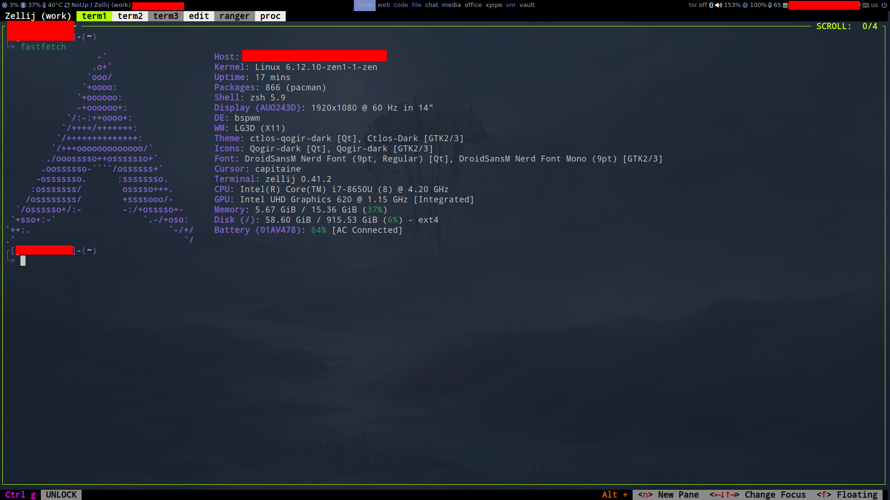

# How it looks like



## Installation
This repo is designed to be used with [GNU Stow](https://www.gnu.org/software/stow/).

Quick start:

Change $USER to your username in whole dir

```
cd ~ # you need to clone repo to $HOME directory
git clone https://github.com/Gnu-Gorets/dotfiles.git ~/dotfiles_raw && mv -v ~/dotfiles_raw/laptop/t480/dotfiles/* ~/ && rm -rf ~/dotfiles_raw
cd dotfiles
stow alacritty
```

If you want to uninstall symlink, run `stow -D alacritty`
