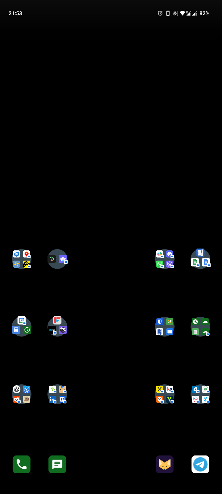
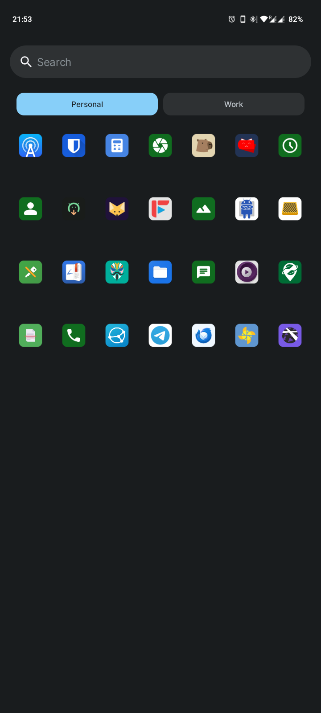
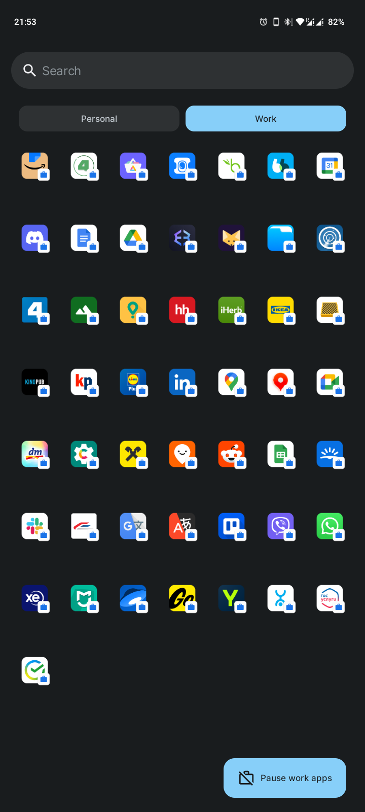

# Moto g34

### How it looks like

Home screen:  

  

Apps in personal account:  

  

Apps in work account:  

  

### Installation

1. Unlock bootloader
2. Install /e/os
3. Install root (magisk)
4. Install insular for personal+work profiles
5. Install apps from [list of apps](./apps.md)
